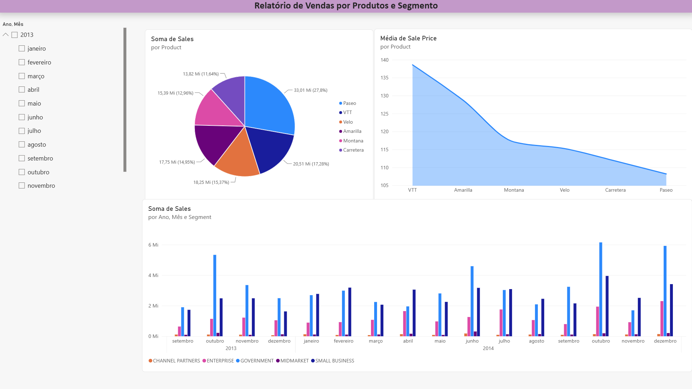
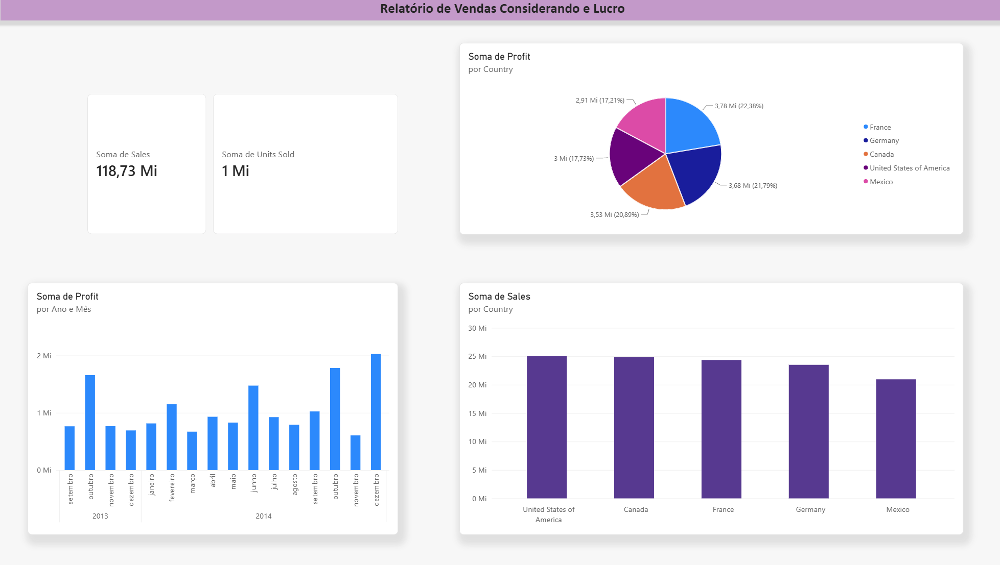

# 📊 Análise de Vendas e Rentabilidade com Power BI

> Projeto desenvolvido durante o Bootcamp Universia – Primeiros Passos em Power BI.

## 📌 Sobre o Projeto

Este projeto apresenta uma análise de vendas e rentabilidade desenvolvida no Power BI, com o objetivo de transformar dados comerciais em informações que auxiliem na compreensão do desempenho do negócio.

A análise explora indicadores de vendas, lucro, produtos, segmentos e distribuição geográfica, permitindo identificar padrões e oportunidades a partir dos dados.

Os arquivos deste repositório incluem o relatório em PDF e o arquivo `.pbix` desenvolvido durante a trilha de aprendizagem.

## 🎯 Objetivo
Construir um Dashboard Gerencial para analisar faturamento, margem de lucro e distribuição de unidades vendidas, considerando diferentes produtos, segmentos de clientes e países.

## 📊 Dashboard

### Análise de Vendas e Lucro

## 🛠️ Tecnologias e Conceitos Aplicados
- **Power BI:** Criação de dashboards, visuais e cartões de KPIs.
- **DAX:** Criação e utilização de medidas e cálculos para análise dos indicadores.
- **Análise de Dados:** Tratamento e exploração de dados para extração de métricas de negócio.
- **Storytelling com Dados:** Estruturação visual orientada à clareza e à comunicação dos resultados.

## 🔍 Principais Insights do Dashboard
A partir do relatório desenvolvido, destacam-se os seguintes resultados analíticos:
- **Governo é o principal segmento em rentabilidade:** representa **65,04% do lucro total**, equivalente a **11,39 milhões**.
- **Paseo é o produto com maior volume de vendas:** representa **27,8% do faturamento**, com **33,01 milhões** em vendas.
- **O período analisado apresenta 118,73 milhões em vendas**, correspondentes a aproximadamente **1 milhão de unidades vendidas**.
- **Os Estados Unidos apresentam o maior volume de vendas entre os países analisados**, enquanto a **França apresenta a maior rentabilidade**, com **3,78 milhões** em lucro.

## 💡 Competências Demonstradas
- Análise exploratória de dados
- Criação e interpretação de indicadores
- Construção de dashboards
- Visualização de dados
- Identificação de padrões e tendências
- Comunicação de insights
